# blogSpace

<h2>Login - SignUp page </h2>
  
This is the signup / login page. A user can create a new account or can directly login if his/her account already exists.
  The login and signup buttons changes color on hovering over it. User can also scroll down to see various artworks and qoutes.

  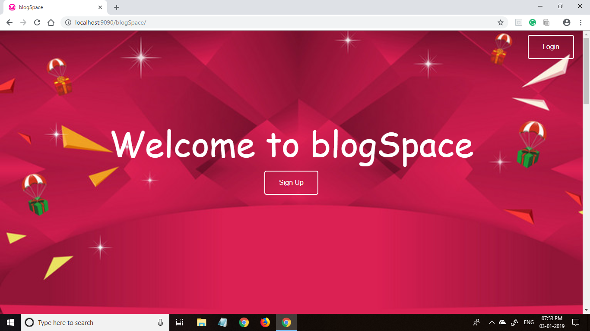

  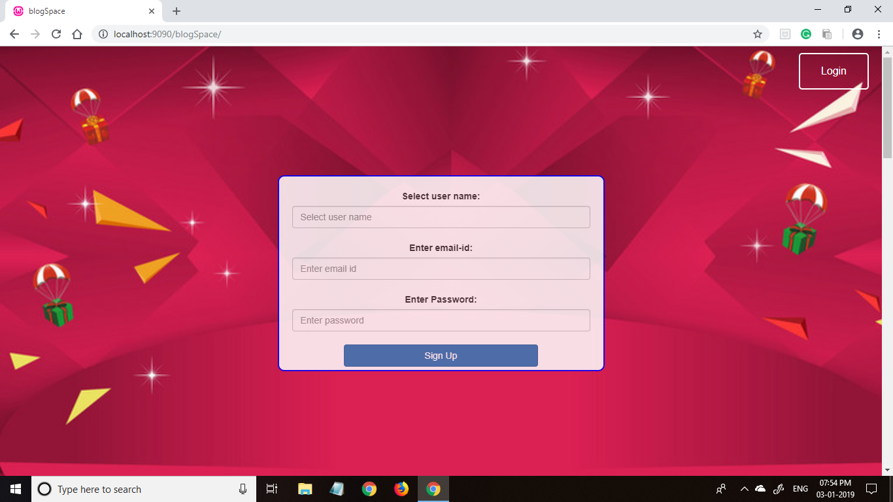

  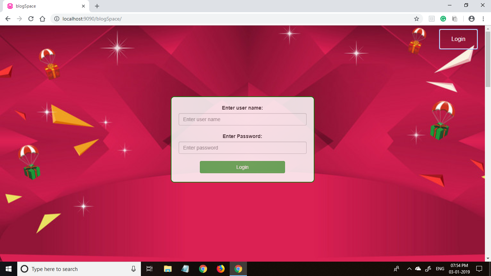

  

  <h2>Profile Page</h2>
  
This is the user's profile page. The user can upload his/her image as profile picture. The user description box also shows the email id, no. of blogs posted by the user and the no. of followers he/she has. At the bottom of the page you can find the blogs written by the user.

  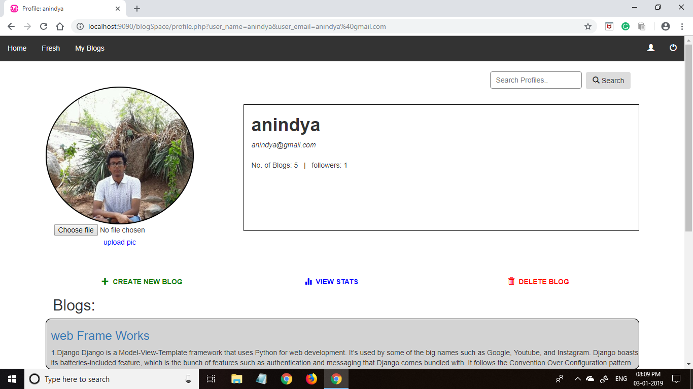
  

  A user can create new blog, view statistics or delete blogs through the options given.
  

  <h4>1.Create new Blog</h4>
  
The create new blog page appears to be like this. A user have to enter the blog title and then write the blogs. A user manual is provided to help the user correctly upload his/her blog. The user can also preview his/her work by clicking the 'preview' button. Once the blog is completely finished the user can click on the 'upload' button to upload his/her blog. After uploading the user is redirected to his/her blog page.
  

  

    <i>Security was a concern. Thus I used prepared statements and HTML Purifiers to reduce the possibility of XSS and other security threats</i>.    
  

   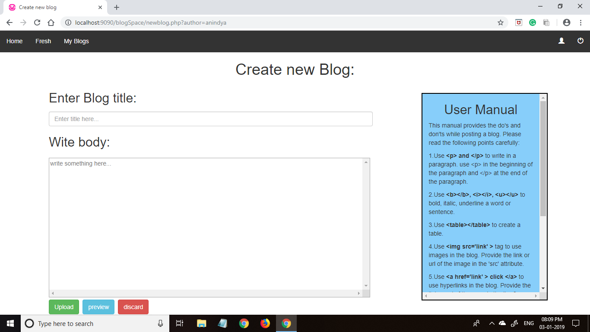
  <h4>2.View Statistics</h4>
  

    This page shows the statistics of the users posts. The page consists 2 tables, one showing the no. of likes on each posts and one showing no.of comments per posts. 
  

   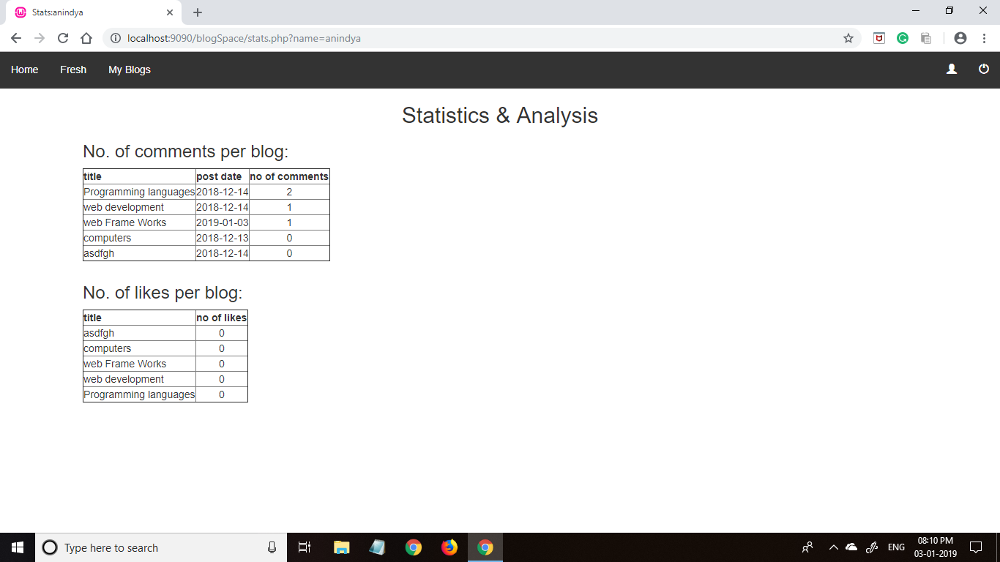
  <h4>3.Delete blogs</h4>
  

    This page allows the user to delete his/her existing blog from his/her account. To confirm the blog, a little portion of the blog is also shown. The user can also click on the blog title to see the complete blog and confirm it's deletion. To delete a blog the user just have to click on the radio button and press on 'confirm delete' to delete the blog.  
  

   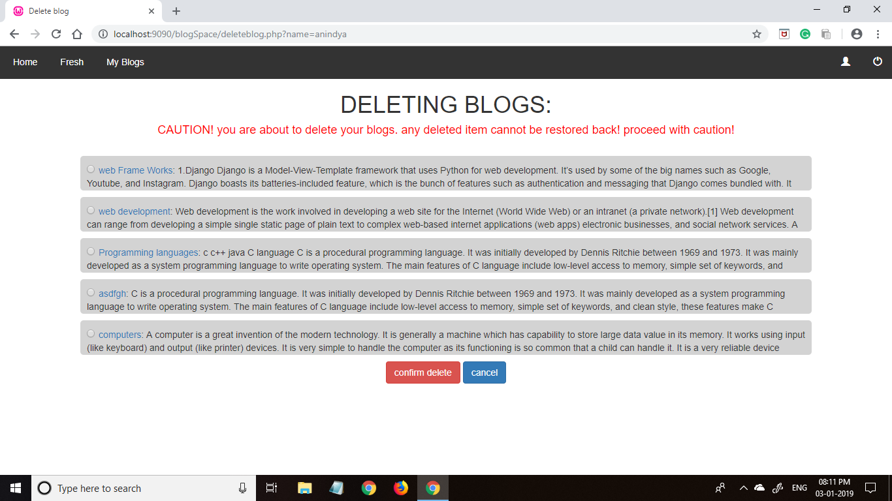
  <h4>4.Searching and Visting other's profile</h4>
  

    The user can search for other users. They can visit them, look into their profiles, read their blogs and follow them.    
  

  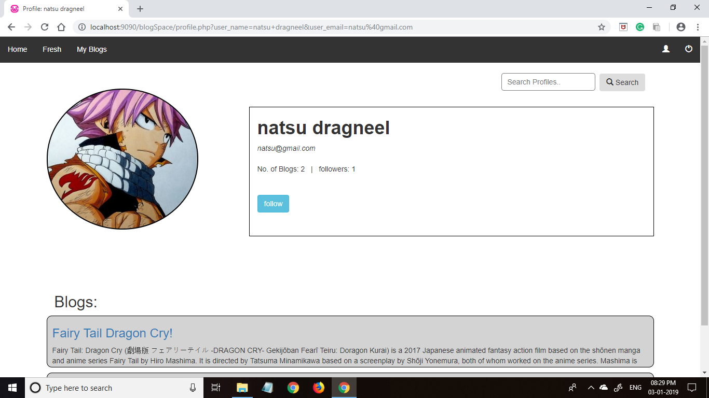  

  <h2>Home Page</h2>
  

    This is the home page. The home page shows the blogs written by them and the authors they follow. The user can also search for the blogs by writting the title(full/part) of the blog the the search bar. 
  

  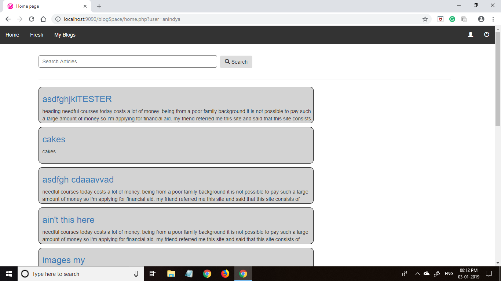  

  <h2>Blog Page</h2>
  

    
  

  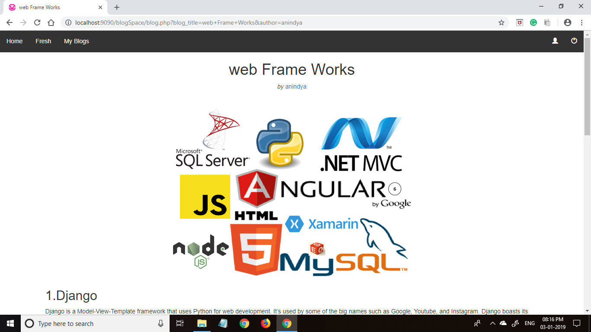

  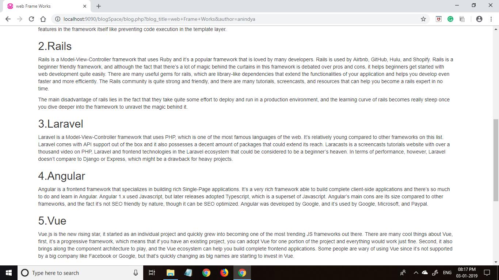

  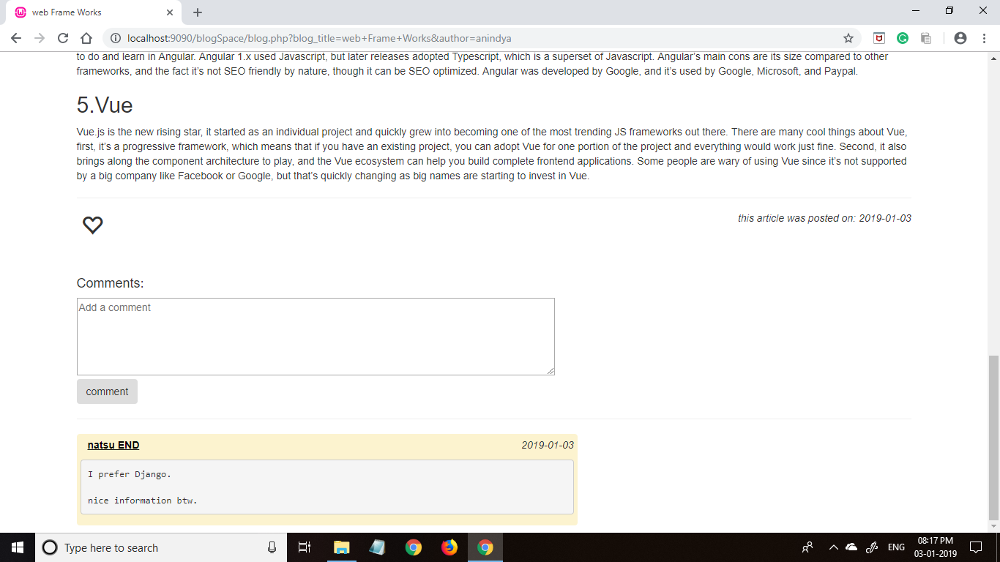

    
  

